# Excercise 1
*Practice with all the local repository commands from the slides*
**git status**
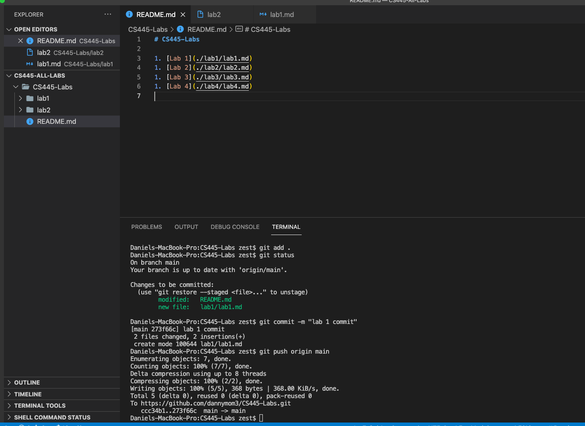

**git diff**
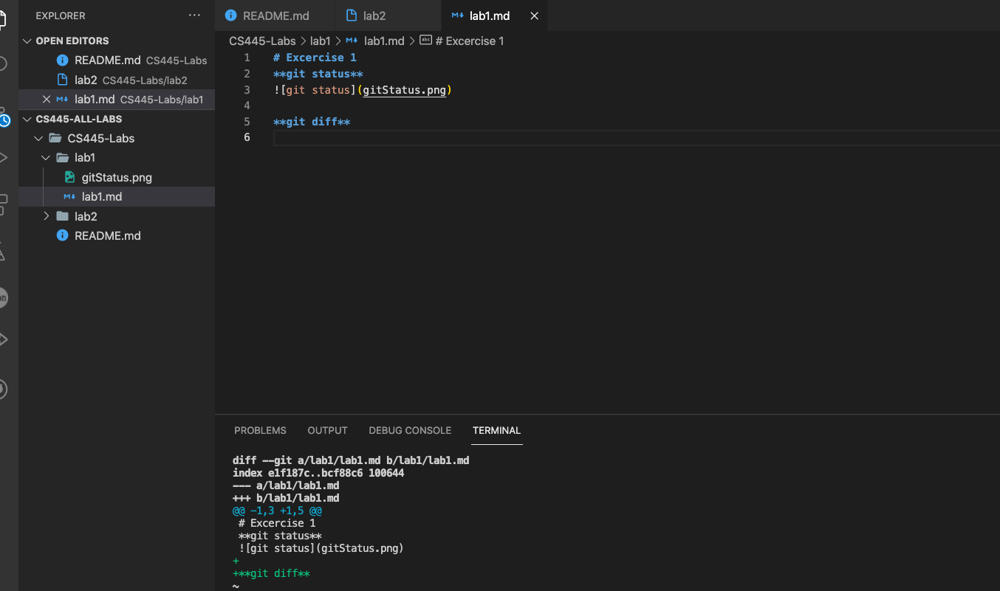

**git show**
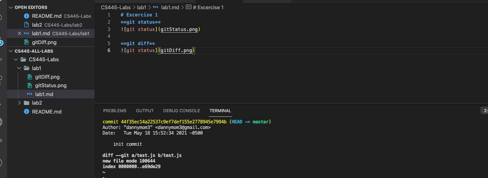

**git restore**
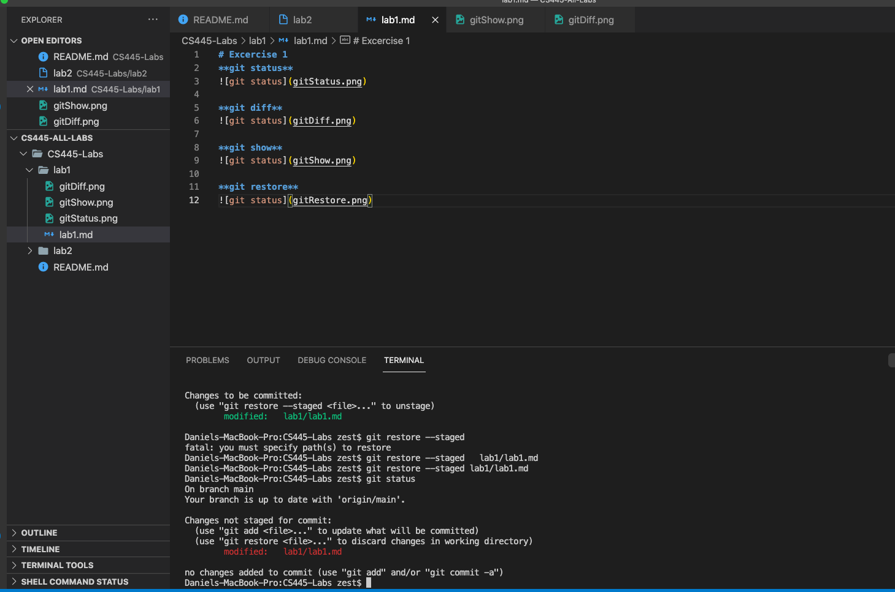

**git add commit**
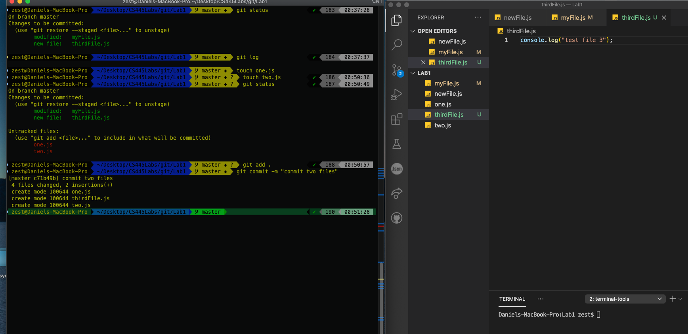

**git checkout**
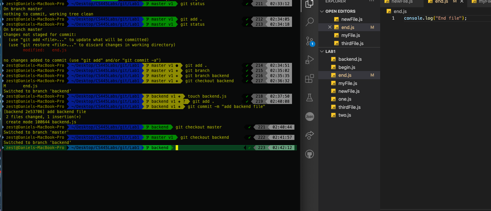

**git revert**
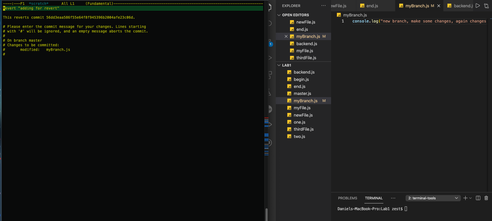

**git merge**

**git merge conflict**
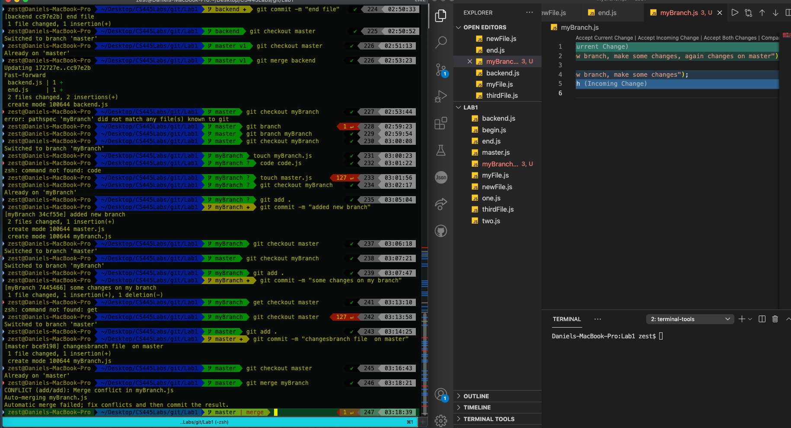

**git tag**
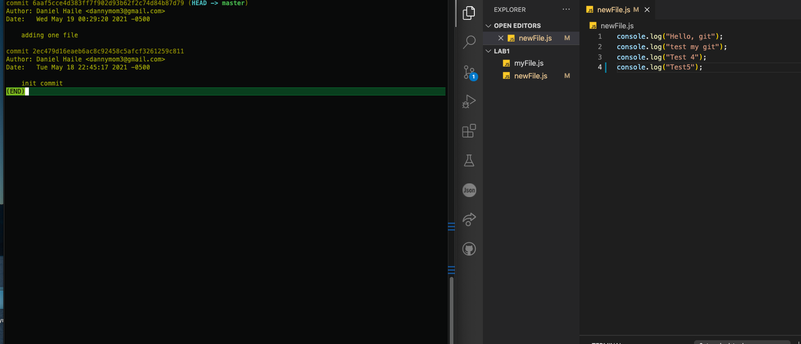

# Excercise 2 
*Practice with all the remote repository commands from the slides*
*Add at least 5 markdown syntax (For example: Headers, Bold, Code, Unordered List, Links)*
**Unordered list**
* Item 1
* Item 2
  * Item 2a
  * Item 2b

**Blockquotes**
  My favorite quotes:

> Life is what happens when you're busy making other plans - John Lennon
> The greatest glory in living lies not in never falling, but in rising every time we fall. - Nelson Mandela

# Excercise 3
**Practice with all the third party repositories commands from the slides**
*Assume we are working with the following upstream:*
[GitHub](https://github.com/bellaxing/CS445-May2021-Lab1)

**some steps**
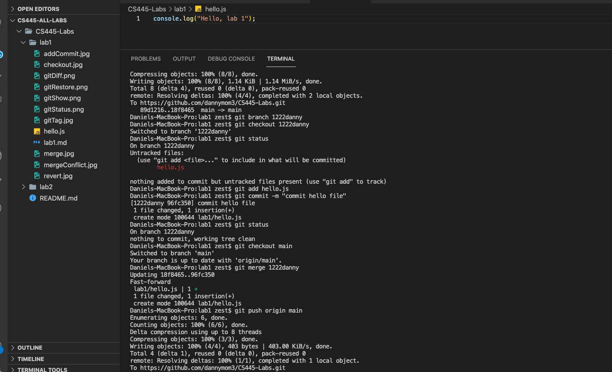

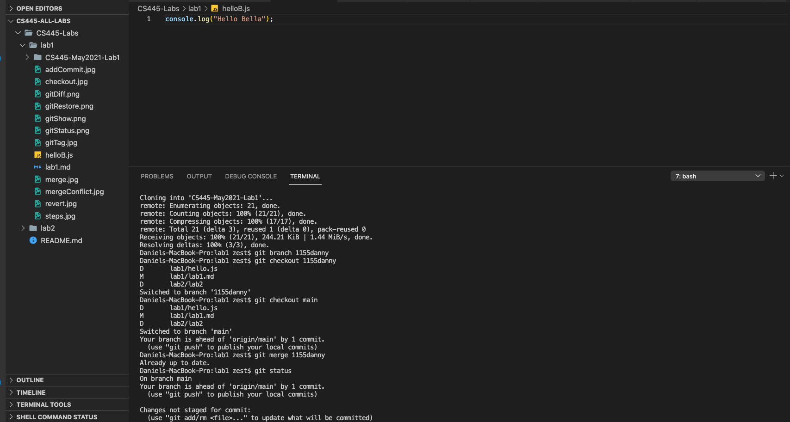