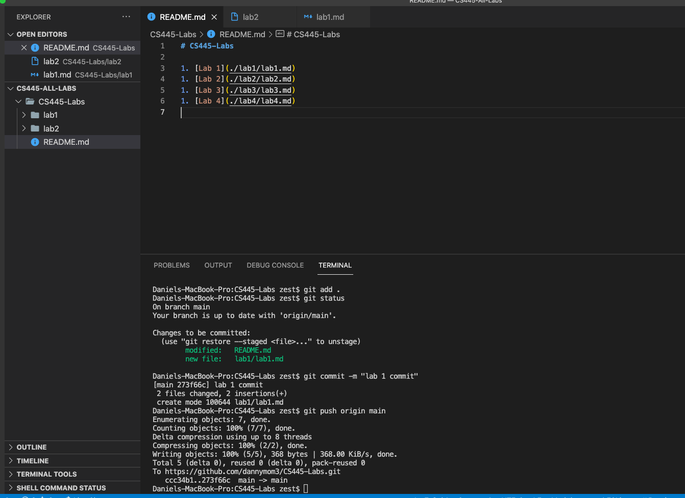
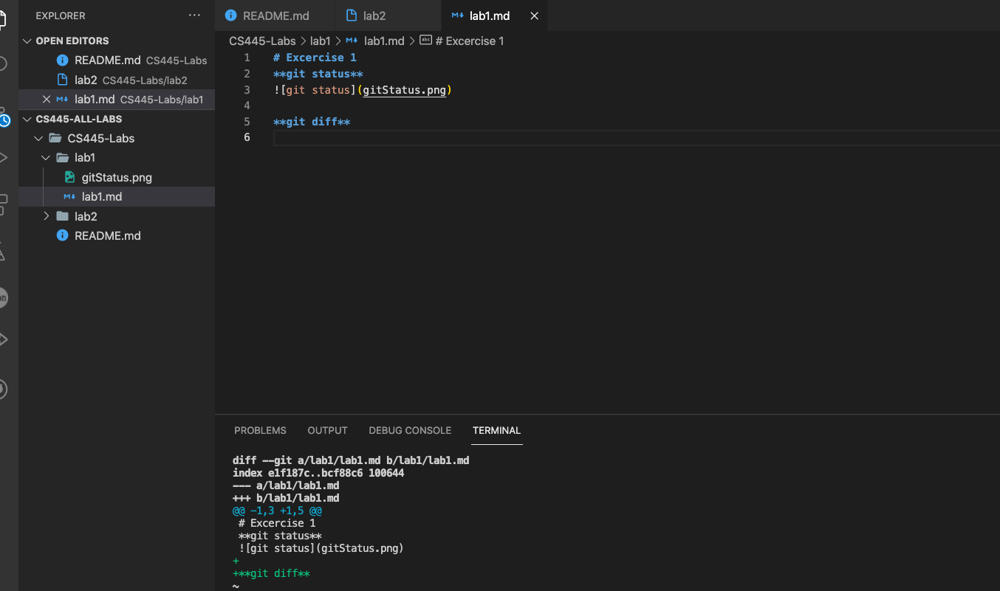
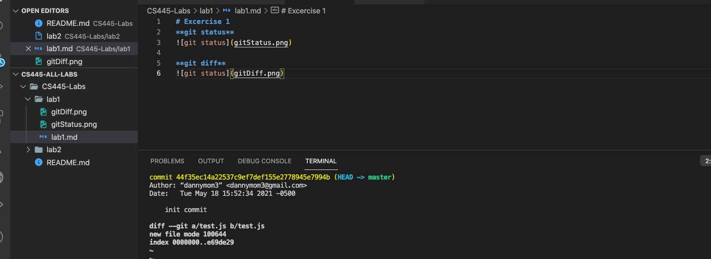
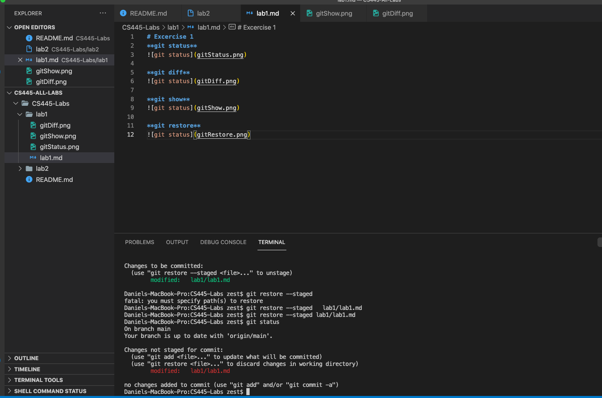
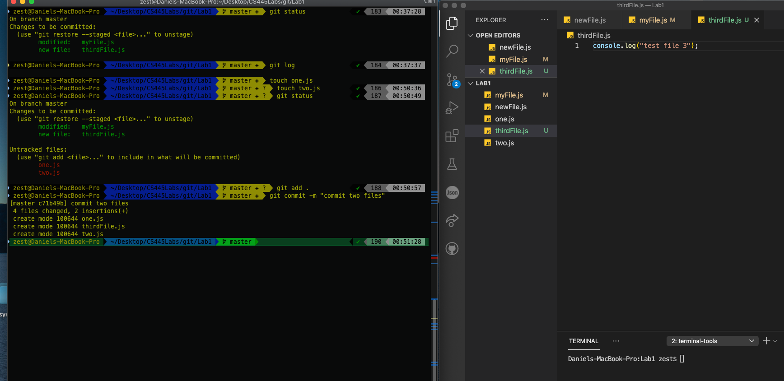
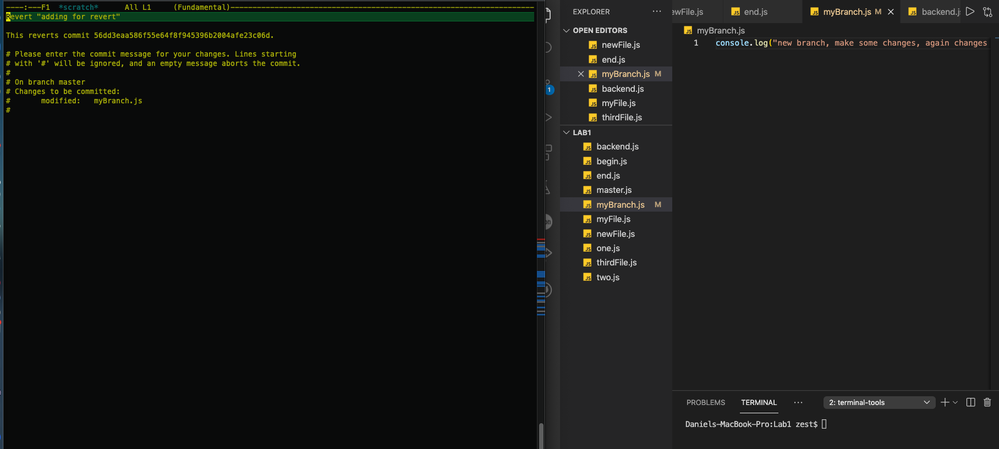
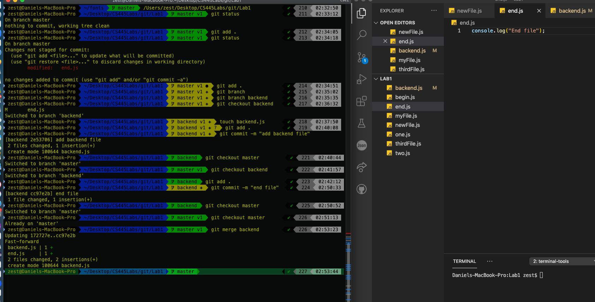
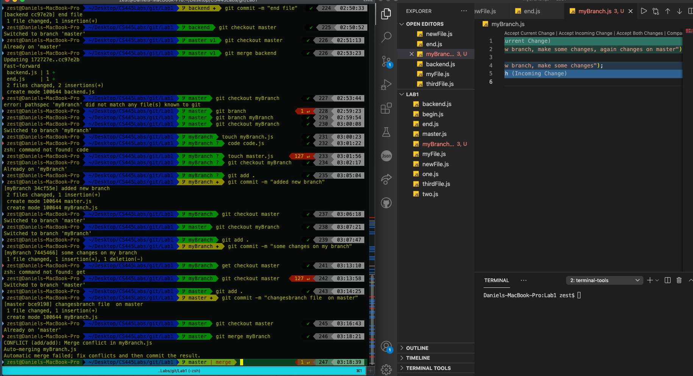
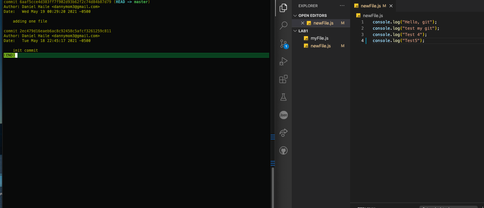

# Excercise 1
*[Practice with all the local repository commands from the slides]*
**git status**

**git diff**

**git show**

**git restore**

**git add commit**

**git checkout**

**git revert**

**git merge**

**git merge conflict**

**git tag**

# Excercise 2 
*[Practice with all the remote repository commands from the slides]*

# Excercise 3
*[Practice with all the third party repositories commands from the slides]*
