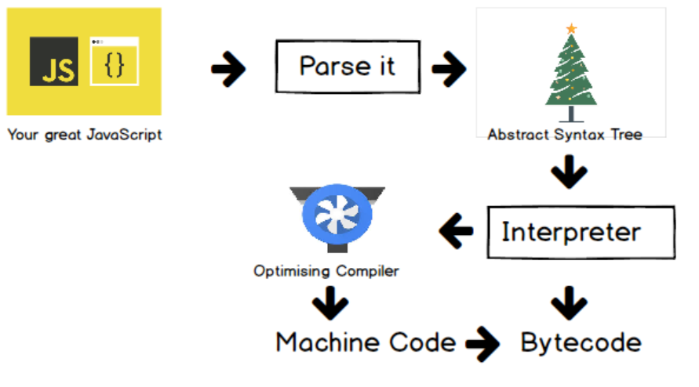

# JS Engine Optimize
# Question: write a paper about how JS engine optimize JavaScript code

# The V8 Engine and JavaScript Optimization
V8 is Google’s engine for compiling our JavaScript. Firefox has it’s own engine called 
SpiderMonkey, it’s quite similar to V8 but there are differences. 
We will be discussing the V8 engine in this article.

1. A couple of facts about the V8 engine:

     1. Written in C++ and used in Chrome and Node.js (and the newest release of Microsoft Edge)
     1. Implements ECMAScript as specified in ECMA-262

# The JavaScript Journey
*The following diagram shows all the steps how the **Javascript** journey looks like:*

*fig1: JS journey diagram*