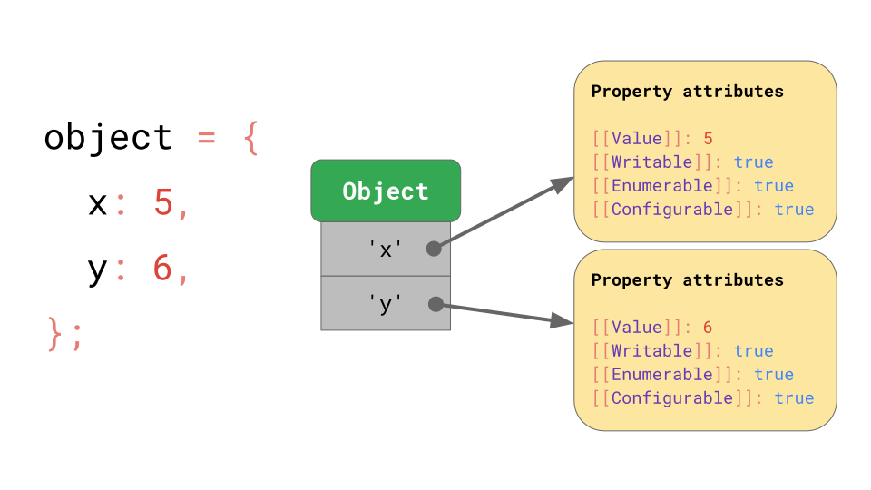

# JS Engine Optimize
# Question: write a paper about how JS engine optimize JavaScript code

# The V8 Engine and JavaScript Optimization
V8 is Google’s engine for compiling our JavaScript. Firefox has it’s own engine called 
SpiderMonkey, it’s quite similar to V8 but there are differences. 
We will be discussing the V8 engine in this article.

1. A couple of facts about the V8 engine:

     1. Written in C++ and used in Chrome and Node.js (and the newest release of Microsoft Edge)
     1. Implements ECMAScript as specified in ECMA-262

# The JavaScript Journey
*The following diagram shows all the steps how the **Javascript** journey looks like:*


*fig1: JS journey diagram*


In this article we’ll discuss how the JavaScript code gets parsed and how to get as much of your JavaScript to the 
Optimizing Compiler as possible. The Optimizing Compiler (aka **Turbofan**) takes our JavaScript code and 
converts it to high performance Machine Code, so the more code we can give it the faster our application will be. 
As a side note, the interpreter in Chrome is called **Ignition.**

# JavaScript’s object model
When it comes to objects, V8 under the hood has a type system to differentiate your objects.
For example, how do JavaScript engines implement the JavaScript object model, and which tricks do they use to speed up accessing 
properties on JavaScript objects? As it turns out, all major engines implement this very similarly.

The ECMAScript specification essentially defines all objects as dictionaries, with string keys mapping to property attributes.



*fig2: JS Object Model diagram*

# Objects
When it comes to objects, V8 under the hood has a type system to differentiate your objects:

# Monomorphism
The objects have the same keys with no differences.

_mono example_
```
const person = { name: 'John' }
const person2 = { name: 'Paul' }

```
 
# Polymorphism
The objects share a similar structure with some small differences.

_poly example_
```
const person = { name: 'John' }
const person2 = { name: 'Paul', age: 27 }

```
 
# Megamorphism
The objects are entirely different and cannot be compared.

_mega example_

```
const person = { name: 'John' }
const building = { rooms: ['cafe', 'meeting room A', 'meeting room B'], doors: 27 }

```
 
So now we know the different objects in V8, let’s see how V8 optimizes our objects.

# Tips for Creating Objects
If you can, you should declare your properties in the constructor. This will ensure the object 
structure stays the same so V8 can then optimize your objects.
```
class Point {
  constructor(x,y) {
    this.x = x
    this.y = y
  }
}

const p1 = new Point(11, 22) 
const p2 = new Point(33, 44)

```

# You should keep the property order constant, take the following example:

```
const obj = { a: 1 } // hidden class created
obj.b = 3

const obj2 = { b: 3 } // another hidden class created
obj2.a = 1

// this would be better
const obj = { a: 1 } // hidden class created
obj.b = 3

const obj2 = { a: 1 } // hidden class is reused
obj2.b = 3
```

# General Optimization Tips
So now let’s get into some general tips that will help your JavaScript code be better optimized.

Fix function argument types
When arguments are being passed to a function it’s important they are the same type. 
**Turbofan** will give up trying to optimize your JavaScript after 4 tries if the argument types are different.

Take the following example:
```
function add(x,y) {
  return x + y
}

add(1,2) // monomorphic
add('a', 'b') // polymorphic
add(true, false)
add({},{})
add([],[]) // megamorphic - at this stage, 4+ tries, no optimization will happen
 ```
_Another tip is to make sure to declare classes in the global scope:_

**_don't do this_**
```
function createPoint(x, y) {
  class Point {
    constructor(x,y) {
      this.x = x
      this.y = y
    }
  }

  // new point object created every time
  return new Point(x,y)
}

function length(point) {
  //...
}
```